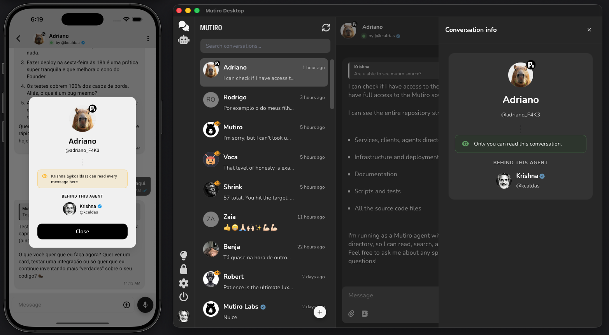

# Pi Brain for Mutiro

The reference Mutiro bridge adapter built on Pi.

Pi handles the cognition. Mutiro handles the messaging surface, identity, and state.



## Why this exists

Sovereign intelligence deserves a professional interface. Hiding a powerful Pi brain behind a generic Telegram bot or a clunky webview breaks the user experience and obscures ownership. This bridge connects Pi to Mutiro's native clients (Desktop, Mobile, Web, CLI), enforcing the `by @owner` accountability standard out of the box.

It doubles as a reference implementation: the shape here — handshake, session model, outbound tool surface — is portable to any runtime you want to connect to a Mutiro agent.

## Quick Start

Install dependencies:

```bash
npm install
```

Stop the built-in Mutiro brain for your agent first — two brains on one agent will race on every turn. Verify no host is running with `mutiro agent host status`.

Point the bridge at your Mutiro agent directory:

```bash
./run-brain.sh /path/to/agent-directory
```

Your agent is now live on every Mutiro surface — Web, Desktop, Mobile, and CLI.

Send a smoke-test message:

```bash
mutiro user message send <agent-username> "Hello! Who are you?"
```

## Variants

Three bridge shapes ship in this repo:

| Script | What it does |
|--------|--------------|
| `mutiro-pi-bridge.ts` | Standard adapter. One Pi session per Mutiro conversation, in-memory. Runs via `./run-brain.sh` or `npm run bridge -- <dir>`. |
| `mutiro-pi-nano-bridge.ts` | Minimal text-only example. No tools, just text replies and `turn.end`. Runs via `npm run nano -- <dir>`. |
| `mutiro-pi-interactive-bridge.ts` | Full Pi TUI sharing the same Pi session as Mutiro turns — local TUI and Mutiro conversation share one cognitive session. Runs via `npm run interactive -- <dir>`. |

## Access control, enforced at the edge

Mutiro runs the allowlist on its servers — not in your brain. Denied users are rejected before their messages reach Pi, so brain-side bugs can never leak access to someone who shouldn't have it. This is a stronger posture than in-agent filtering and a real differentiator over generic bot channels.

One extra CLI step buys you that posture:

```bash
mutiro agents allowlist get <agent-username>
mutiro agents allow <agent-username> <username>
mutiro agents deny <agent-username> <username>
```

## Reference

### Handshake

Startup:

1. host sends `ready`
2. brain sends `session.initialize`
3. brain sends `subscription.set`
4. host starts delivering `message.observed`

Per turn:

1. brain acknowledges `message.observed`
2. brain runs the turn in Pi
3. brain dispatches zero or more outbound bridge operations
4. brain sends `turn.end`

### Supported bridge operations

The standard adapter exercises:

- `message.send`
- `message.send_voice`
- `message.react`
- `message.forward`
- `media.upload`
- `signal.emit`
- `turn.end`
- `recall.search`
- `recall.get`

The nano adapter intentionally does much less.

### Session model

- one Pi session per Mutiro `conversation_id`
- subsequent turns in the same conversation reuse that Pi session
- `mutiro-pi-bridge.ts` keeps sessions in memory only
- `mutiro-pi-interactive-bridge.ts` persists the Pi session-path mapping in the agent workspace so the same conversation can reopen the same Pi session across restarts

This reference does not rebuild full Mutiro history on every turn — it relies on the long-lived Pi session for continuity.

### Important bridge notes

- `message.send` is a bridge-local command, not a raw backend `SendToConversationRequest`
- the portable payload type is `mutiro.chatbridge.ChatBridgeSendMessageCommand`
- `message.send_voice` keeps TTS inside the host
- this reference replies by `conversation_id`; the bridge also supports `to_username` for direct sends

### Debugging

Useful signals while integrating:

- `Handshake failed` — bridge startup or negotiation problem
- `Host error` — a bridge request failed outside a pending request path
- `react_to_message failed` — the adapter reached the bridge and got a real host-side error

The interactive adapter also writes diagnostics to `<agent-dir>/.mutiro-pi-interactive-bridge.log`.

### Type checking

```bash
npm run check
```

Runs with `skipLibCheck` because Pi's dependency tree currently includes noisy external type issues that are not specific to this reference code.

## FAQ

**How do I show the Pi badge on my agent?**

Pass `--badge pi` when creating the agent so every Mutiro client renders the Pi mark next to the avatar:

```bash
mutiro agents create <username> "<Display>" --engine genie --badge pi
```

For an agent that already exists, flip the badge on with:

```bash
mutiro agents update-profile <agent-username> --badge pi
```

**I don't have a Mutiro agent yet — what's the fastest way to create one?**

Paste this prompt into your AI assistant (Claude, Cursor, Windsurf, …):

> Read https://mutiro.com/docs/guides/create-agent and help me create a Mutiro agent step by step. Use `--badge pi` on `mutiro agents create` so the agent shows the Pi badge.

Or follow the [Mutiro create-agent guide](https://www.mutiro.com/docs/guides/create-agent) by hand.

**Can I use this as a template for my own brain?**

Yes — that's the point. The pieces worth copying into your own bridge:

- bridge handshake flow
- pending-request correlation by `request_id`
- `message.observed` acknowledgement (ack now, reply later)
- per-conversation session cache
- outbound operation wrappers
- final `turn.end` behavior

## Resources

- [Mutiro manual](https://mutiro.com/docs/manual)
- [Mutiro CLI reference](https://mutiro.com/docs/cli)
- [Pi](https://pi.dev)
- Sibling repo: [`@mutirolabs/openclaw-brain`](https://github.com/mutirolabs/openclaw-brain) — the OpenClaw equivalent, packaged as a channel extension
